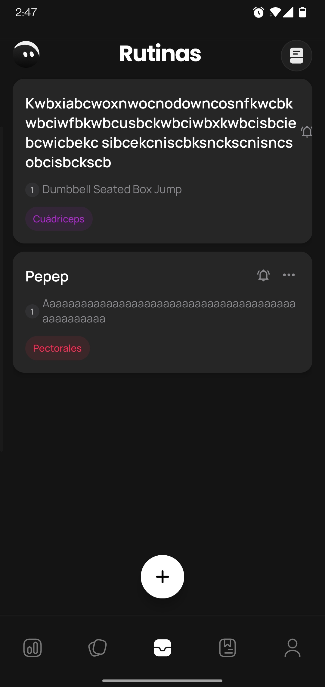
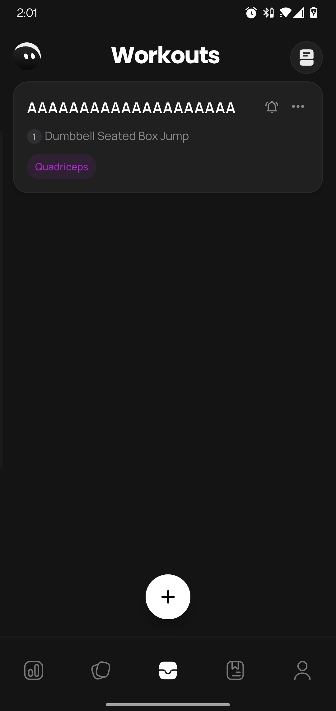
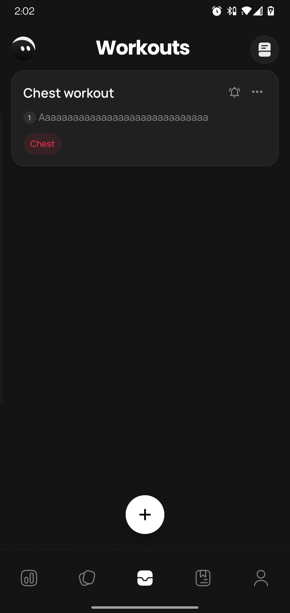

## BUG-001 - No existe límite de caracteres para nombres de rutinas

- **Detectado** en: v1.0.0 build 24
- **Corregido** en: v1.0.0 build 25

- **Severity**: Medium
- **Priority**: Medium
- **Estado**: Fixed

### Descripción
Los campos de nombre de rutinas no poseen un límite máximo de caracteres.

### Pasos para reproducir
1. Ir a la sección de rutinas.
2. Pulsar el botón "+".
3. Seleccionar "Rutina de fuerza".
4. Introducir un nombre de 100 caracteres, por ejemplo:
   "AAAAAAAAAAAAAAAAAAAAAAAAAAAAAAAAAAAAAAAAAAAAAAAAAAAAAAAAAAAAAAAAAAAAAAAAAAAAAAAAAAAAAAAAAAAAAAAAAAAA"
5. Continuar con la creación de la rutina.
6. Añadir un ejercicio válido.
7. Pulsar "Crear rutina".

### Resultado actual
La aplicación permite guardar un nombre de 100 caracteres. En la tarjeta de la rutina, el texto ocupa varias líneas y desplaza los demás elementos del componente.

### Resultado esperado
Los campos deberían limitar la cantidad máxima de caracteres permitidos.

### Impacto
Los nombres excesivamente largos pueden generar problemas de visualización y afectar la experiencia de usuario.

### Evidencia
- Captura antes de la corrección:

- Captura después de la corrección:

## BUG-002 - No existe límite de caracteres para nombres de ejercicios personalizados

- **Detectado** en: v1.0.0 build 24
- **Corregido** en: v1.0.0 build 25

- **Severity**: Medium
- **Priority**: Medium
- **Estado**: Fixed

### Descripción
Los campos de nombre de ejercicios personalizados no poseen un límite máximo de caracteres.

### Pasos para reproducir
1. Ir a la sección de rutinas.
2. Pulsar el botón "+".
3. Seleccionar "Rutina de fuerza".
4. Introducir un nombre de rutina válido.
5. Pulsar "Crear ejercicio personalizado".
6. Introducir un nombre de 100 caracteres como: "AAAAAAAAAAAAAAAAAAAAAAAAAAAAAAAAAAAAAAAAAAAAAAAAAAAAAAAAAAAAAAAAAAAAAAAAAAAAAAAAAAAAAAAAAAAAAAAAAAAA"
7. Seleccionar un músculo principal.
8. Pulsar "Crear ejercicio".

### Resultado actual
La aplicación permite crear un ejercicio personalizado con un nombre de 100 caracteres. En la tarjeta del ejercicio, el texto ocupa varias líneas y desplaza los demás elementos del componente.

### Resultado esperado
Los campos deberían limitar la cantidad máxima de caracteres permitidos.

### Impacto
Los nombres excesivamente largos pueden generar problemas de visualización y afectar la experiencia de usuario.

### Evidencia
- Captura antes de la corrección:

- Captura después de la corrección:

